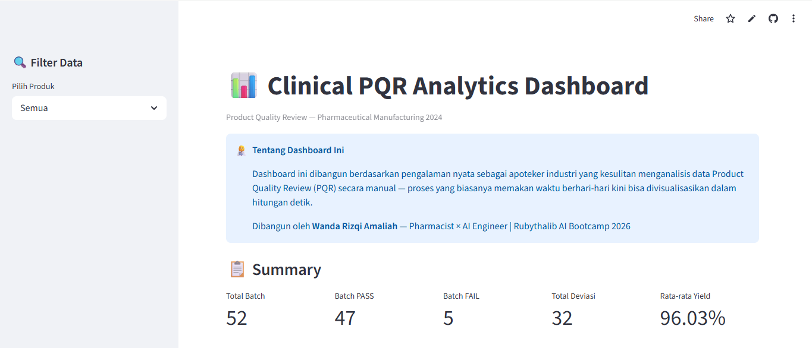

# 📊 Clinical PQR Analytics Dashboard

Dashboard interaktif untuk analisis Product Quality Review (PQR) di industri farmasi — dibangun berdasarkan pengalaman nyata sebagai apoteker industri.

## 🔗 Live Demo
[Buka Dashboard](https://wandarizqi-pqr-analytics-dashboard.streamlit.app/)

## 🧠 Latar Belakang
Sebagai apoteker di industri farmasi, proses analisis PQR dilakukan secara manual menggunakan spreadsheet — memakan waktu berhari-hari dan rawan human error. Dashboard ini hadir sebagai solusi untuk mengotomasi dan memvisualisasikan data PQR secara real-time.

## ✨ Fitur
- Trend rata-rata yield per bulan
- Analisis deviasi per produk & root cause
- OOS & OOT tracker per bulan
- CAPA tracker (Open / In Progress / Closed)
- Process Capability Chart (Cp, Cpk, Pp, Ppk)
- Filter interaktif per produk

## 🛠️ Tech Stack
- Python
- Pandas
- Plotly
- Streamlit

## 📁 Dataset
Dataset yang digunakan adalah dummy data yang dibangun berdasarkan struktur data PQR industri farmasi nyata, mencakup 52 batch produksi sepanjang 2024.

## 👩‍⚕️ About
Dibangun oleh **Wanda Rizqi Amaliah**
Pharmacist × AI Engineer | Rubythalib AI Bootcamp 2026
